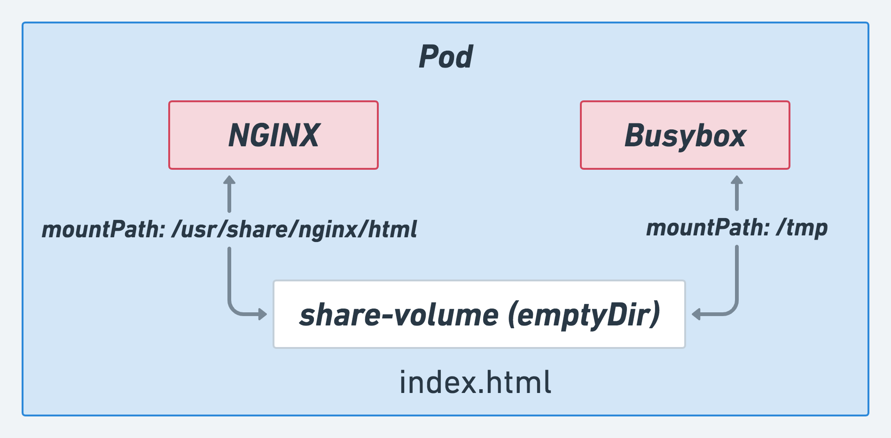
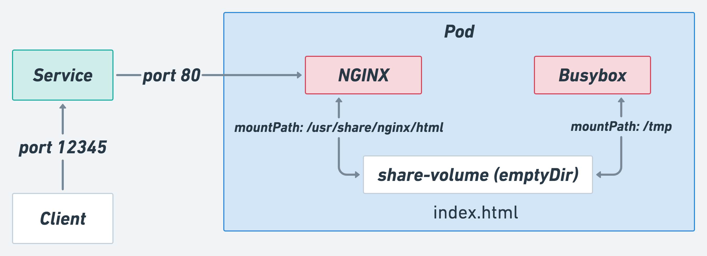

# Pod + Volumes

1. 參考投影片使用 `emptyDir`，撰寫含有 2 個容器的 pod 的 YAML (`pod-1`)



* container images:
  * `nginx`: 掛載到 /usr/share/nginx/html
  * `busybox`: 掛載到 /tmp，並利用 `watch echo 'Version 1' > /tmp/index.html` 建立 index.html

因為 busybox 沒有預設啟動時執行的 process，導致容器啟動後就會立刻離開。透過 command 將指令傳入

```yaml
    - name: busybox
      image: busybox:latest
      # container 內需要有個 process 持續執行才能存活
      # 這邊用 watch 方式，讓他持續執行 echo 指令
      command:
        - watch
        - echo 'Version 1' > /tmp/index.html
```

2. Apply Pod YAML

```bash
$ kubectl apply -f <file>.yaml
```

3. Dump Pod YAML

```bash
$ kubectl get <resource> <name> -o yaml

# 將輸出變成檔案
$ kubectl get <resource> <name> -o yaml > <file>.yaml
```

4. Delete Resources

```bash
$ kubectl delete -f <file>.yaml
```

# Service



1. 參考投影片撰寫 `service` 的 YAML

* 把 requests 只能送往上面 `pod-1`
* service 的 port 開在 `12345`

2. 利用 `port-forward` 建立本地到遠端 service 的連線

* 利用 `get` 查看剛建立的 service 相關資訊

```bash
$ kubectl port-forward svc/<svc> <local-port>:<service-port>
```

* 能夠在網頁上以 `http://127.0.0.1:<local-port>` 看到網頁內容