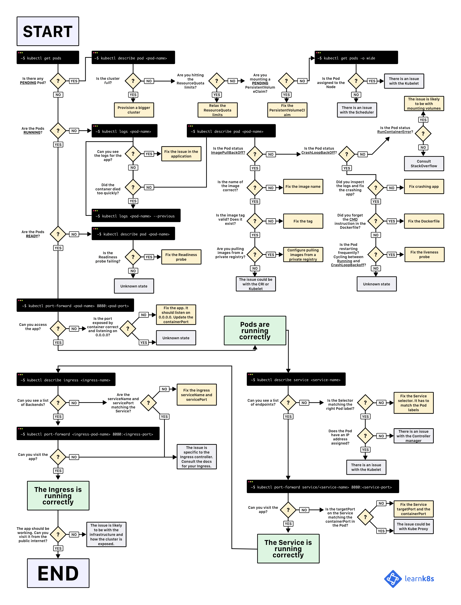

# Kubectl Command

```bash
$ kubectl [options] <verb> <resource> [flags] 
```

* options: Global options (`kubectl options`)
* verb: Operation (i.e. `get`, `delete`, `apply`)
* resource: The resource you want to operate (`kubectl api-resources`)

# Useful Commands

* Get resource information
```bash
# list all resource objects
$ kubectl get <resource>

# list specific resource object
$ kubectl get <resouce> <resource-name>

# list more resources information
$ kubectl get <resouce> -o wide
```

* Apply/Delete file
```bash
$ kubectl apply -f <file>
$ kubectl delete -f <file>
```

* Edit a resource
```bash
$ kubectl edit <resource> <resource-name>
```

* Output resources as YAML file
```bash
# output all resources
$ kubectl get <resource> -o yaml

# output one of resources
$ kubectl get <resource> <resource-name> -o yaml
```

* Display detail information of a resource
```bahs
$ kubectl describe <resource> <resource-name>
```

* Change your namespace
```bash
# change namespace temporally (-n or --namespace)
$ kubectl -n <namespace> ...commands

# write current working namespace to config
$ kubectl config set-context --current --namespace=<namespace>
```

* Exec into a pod
```bash
# kubernetes exec into the first container if `-c` is not specified
$ kubectl exec -it <pod> -c <container> <executable-in-container>
```

* Port-forward a pod/service
```bash
# pod
$ kubectl port-forward pod/<pod> <local-port>:<remote-container-port>

# service
$ kubectl port-forward svc/<svc> <local-port>:<service-port>
```

# Cheat Sheet

* Official guide: https://kubernetes.io/docs/reference/kubectl/cheatsheet/
* Linuxacademy: https://linuxacademy.com/blog/containers/kubernetes-cheat-sheet/


# Troubleshooting Guide
