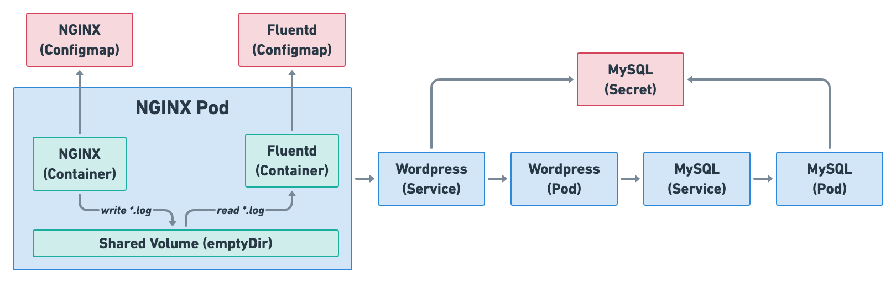

# Homework

請利用 `Nginx`、`Wordpress`、`Fluentd`、`MySQL` 建立一個在 Kubernetes 上運作的部落格系統



## Container Images

* Nginx Image: https://hub.docker.com/_/nginx
  * 反向代理 (Reverse Proxy) 介紹: https://medium.com/starbugs/web-server-nginx-1-cf5188459108
* MySQL Image: https://hub.docker.com/_/mysql
* Fluentd Image: https://hub.docker.com/_/fluentd
* Wordpress Image: https://hub.docker.com/_/wordpress

## Configuration

### Nginx
  * 設定檔放置位置: `/etc/nginx/nginx.conf`
  * nginx.conf
    * 必須修正設定檔內兩處 `<backend-wordpress-svc-name>` 以便指向正確的 Wordpress Service DNS
```
user  nginx;
worker_processes  1;

error_log  /var/log/nginx/error.log warn;
pid        /var/run/nginx.pid;

events {
    worker_connections  1024;
}

http {
    log_format  main  '$remote_addr - $remote_user [$time_local] "$request" '
                      '$status $body_bytes_sent "$http_referer" '
                      '"$http_user_agent" "$http_x_forwarded_for"';

    # Path to access.log & error.log
    access_log /var/log/nginx/access.log  main;
    error_log /var/log/nginx/error.log  warn;

    sendfile        on;
    keepalive_timeout  65;
    gzip  on;

    upstream backend {
        # must match the target service name
        server <backend-wordpress-svc-name>:80;
    }

    server {
        listen       80;
        location / {
            # $http_host is the host name that users seen on the browser URL
            # and it equals to `HTTP_HOST` request header.
            proxy_set_header Host $http_host;

            # You have to change this according to your setup.
            proxy_pass http://<backend-wordpress-svc-name>;

            # Modify `Location` of 301 or 302 HTTP response, so
            # that the browser will follow the correct location.
            proxy_redirect ~^http://[^/]*/(.*) http://$http_host/$1;
        }
    }
}
```

### fluentd:
  * 設定檔放置位置: `/fluentd/etc/fluent.conf`
  * fluend.conf
```
<source>
  type tail
  path /logs/**/access.log
  tag nginx.access
  format nginx
</source>

<source>
  @type tail
  format /^(?<time>\d{4}/\d{2}/\d{2} \d{2}:\d{2}:\d{2}) \[(?<log_level>\w+)\] (?<pid>\d+).(?<tid>\d+): (?<message>.*)$/
  tag nginx.error
  path /logs/**/error.log
</source>

<match nginx.access>
  @type stdout
</match>

<match nginx.error>
  @type stdout
</match>
```

## 作業說明

利用 `Nginx`、`Wordpress`、`MySQL` 建立一個簡易部落格系統 (此次作業無需考慮 DB 狀態是否會消失，後續作業會實作)

1. 讓 Nginx 做 reverse proxy 到 wordpress，而 wordpress 可以連結到 MySQL 來提供部落格服務
    * Container image 可以從上面 Dockerhub 連結取得
    * `wordpress`、`mysql` 需要用到的`環境變數`可在上面 Dockerhub 的網頁下方說明欄內找到
    * Log volume
      * Nginx 會把運作時的 Log 寫入到 `/var/log/nginx/` 底下 (`access.log` 與 `error.log`)，你必須將 `emptyDir` type 的 volume 掛載進到 `/var/log/nginx/` 以便 Nginx container 寫入 log
      * Fluentd 會讀取 `/logs` 底下所有 log，你必須將 `emptyDir` type 的 volume 掛載進到 `/logs` 以便 Fluentd 讀取 Nginx 寫入的 log

2. 為兩個 Pod 增加以下設定
    * resource requests/limits
    * liveness probes、readiness probes
        * 請思考這兩個服務可以用什麼方式檢測是否存活
        * 當容器檢測失敗後要能被自動 restart

3. 為 Pod 增加以下設定
    * 能夠描述該 Pod 的 labels
    * 適當的 restartPolicy

4. 當完成後，你應該要能夠使用 port-forward 看到透過 nginx 看到 wordpress 畫面，並且能正常儲存 blog 文章

## 繳交方式

請至 https://github.com/srcmesh-workshop/kubernetes-adoption-hands-on 開 Pull requests 繳交作業

1. Pod 的 YAML 檔
2. 上面步驟 4 port-forward 的瀏覽器畫面截圖
3. 簡單文件說明你的想法與這樣寫的原因，可以用 YAML comment 取代
