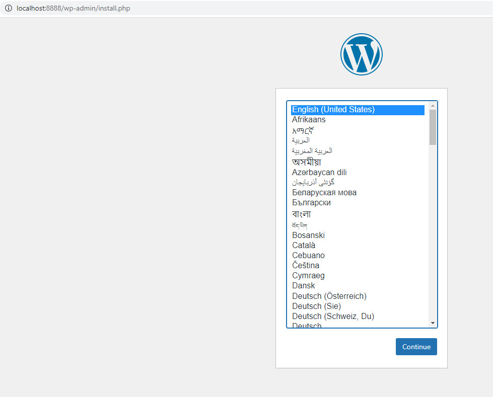
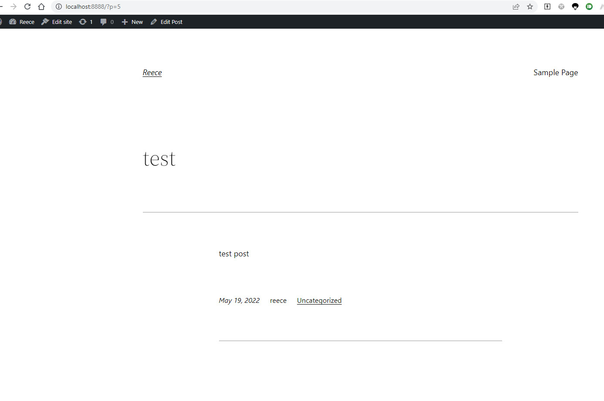

## initial Worldpress

## Post

## 設計想法
1. 跟 DB 相關的連線資訊，比較敏感，所以都放在 mysql-secret 中
2. mysql initailDelay 設為 30 秒，因為 DB 啟動需要較長的時間
3. nginx, fluent 設定檔放在 configMap 管理，需要變更設定時，只需更新 configMap，不用異動 pod yaml
4. nginx, fluent 放在同一個 pod 中，讓 fluent 讀取資料較為快速，避免如果是多的 nginx pod 對應一個 fluent pod 的話，會導致 log 檔過大，造成 fluent 讀取效能差的情形
5. mysql restartPolicy 設為 OnFailure，因為 DB 有時沒回應可能是因為有較複雜的 process 正在處理，如果直接 restart 可能較易造成 DB 資料損毀。所以調整為只有當 MySql Container 有收到 Error 時才重啟。