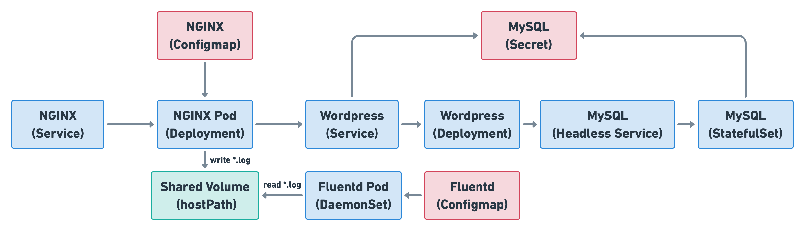

# Homework

## 作業說明

* 根據上面的示意圖以及前份作業內容撰寫對應的 YAML，可在[這裡](https://github.com/srcmesh-workshop/kubernetes-adoption-hands-on/tree/master/workshop/1/ans/homework)找到前份作業解答。
* 為 NGINX 加入 gracefull shutdown 的相關 YAML 設定
* 用 init container 讓 Wordpress 起來時能先檢測 MySQL 的 Service 是否已經存在
  * hint: 用 nslookup 查 Service DNS
* 為 Wordpress 加上 v2beta2 HPA 設定
  * 以 CPU 作為擴縮依據，平均使用率 60% 上下時擴縮
* 分析不同 Application 的重要性，並為他們加上優先權設定
* 利用 Inter-Pod Affinity 讓 Wordpress 能部署在和 MySQL 同個節點上